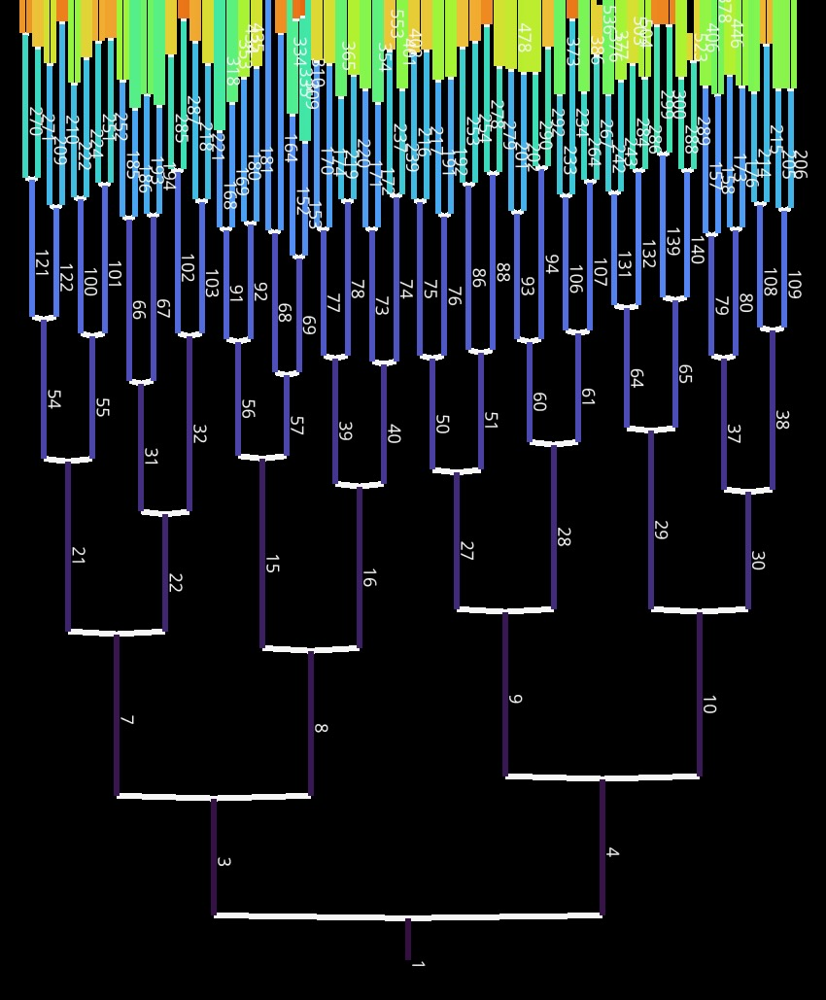

# E. coli Tracking (ECT) Project

[](https://doi.org/10.5281/zenodo.17351896)

A framework for bacterial cell segmentation, tracking, and growth analysis using deep learning and classical image processing.


## Overview

This project provides tools and analysis pipelines for:
- **Cell Segmentation**: Multiple deep learning models (Omnipose, Cellpose, DeLTA2) and a classical method
- **Cell Tracking**: Lineage tracking and cycle analysis
- **Morphological Analysis**: Cell shape and size measurements
- **Growth Dynamics**: Population and single-cell growth analysis
---

## Quick Access Options

### Option 1: View Pre-computed Results (Recommended for Quick Review)
The complete analysis results are available as HTML reports in the `docs/` folder:
- **Model Comparison**: `docs/model_comparison_final.html`
- **Elongated Morphology**: `docs/elongated_morphology_validation.html`
- **Tracking Analysis**: `docs/tracking_cycle_analysis.html`
- **Thesis Document**: `docs/LR_Thesis.pdf`

*(View directly in your browser — no setup required.)*

### Option 2: Download Datasets and Re-run Analysis
For full reproducibility, download the complete dataset from Zenodo and follow the setup below.
---

## Dataset Access

### Download from Zenodo

**Dataset DOI**: [10.5281/zenodo.17351896](https://doi.org/10.5281/zenodo.17351896)

**Citation**:
```
Reed, L. (2025). E. coli Tracking (ECT) Dataset: Time-lapse Microscopy and Segmentation Analysis [Dataset]. Zenodo. https://doi.org/10.5281/zenodo.17351896
```

### Quick Setup for Reproducibility

1. **Download the dataset**:
   - Go to [Zenodo](https://doi.org/10.5281/zenodo.17351896)
   - Download `data.zip` (~5GB)

2. **Extract and organize**:
   ```bash
   # Extract downloaded data
   unzip data.zip -d data
   
   # Ensure the data folder is in your project root
   # Your structure should be: ECT/data/
   ```

3. **Verify data structure**:
   ```bash
   # Check that you have the expected directories
   ls data/
   # Should show: timelapse_data/, processed/, examples/, models/, elongated_morphology/
   ```

## Quick Start

### 1. Setup Environment

```bash
# Clone the repository
git clone https://github.com/LucasGeno/ECT.git
cd ECT

# Create conda environment
# The environment file installs all dependencies needed for all notebooks, tracking, and visualization
conda env create -f notebooks/01_env_setup/environment_tracking.yml
conda activate tracking_env

# Install Jupyter kernel
python -m ipykernel install --user --name tracking_env --display-name "Python (tracking_env)"
```
> *A separate environment file (environment_napari_btrack_arboretum.yml) is included for users wishing to reproduce the Napari-based lineage reconstruction and visualization workflows.

### 2. Verify Data Access

```bash
# Check if data directory exists and contains expected files
python -c "
from pathlib import Path
data_dir = Path('data')
if data_dir.exists():
    print('✓ Data directory found')
    print(f'  Contents: {list(data_dir.iterdir())}')
else:
    print('❌ Data directory not found')
    print('Please download and extract data from Zenodo first')
"
```
## Usage

### Run Analysis
```bash
# Start Jupyter Lab
jupyter lab

# Open notebooks in order:
# 1. notebooks/01_env_setup/01_environment_setup.ipynb
# 2. notebooks/02_data_preprocessing/data_loader.ipynb
# 3. notebooks/03_model_comparison/model_comparison_final.ipynb
# 4. notebooks/04_elongated_morphology/elongated_morphology_validation.ipynb
# 5. notebooks/05_tracking_analysis/tracking_cycle_analysis.ipynb
```

## Project Structure

```
ECT/
├── data/                        # Downloaded from Zenodo
│   ├── timelapse_data/          # LB & M9 tracking datasets
│   ├── training_data/           # Training 
│   ├── processed/               # Precomputed results and test data
│   ├── elongated_morphology/    # Elongated-cell benchmark
│   ├── examples/                # Sample datasets
│   └── models/                  # Pre-trained model files
├── docs/                        # Reports and thesis
│   ├── LR_Thesis.pdf
│   ├── model_comparison_final.html
│   ├── elongated_morphology_validation.html
│   └── tracking_cycle_analysis.html
├── notebooks/                   # Modular Jupyter notebooks
│   ├── 01_env_setup/
│   ├── 02_data_preprocessing/
│   ├── 03_model_comparison/
│   ├── 04_elongated_morphology/
│   └── 05_tracking_analysis/
├── src/                         # Utility scripts
│   ├── data/
│   └── utils/
├── setup_data.py                # Automated directory setup
└── README.md

```
## Example Output

### Cell Lineage Visualization

The tracking analysis produces interactive lineage trees showing cell division patterns across generations:



> *Lineage tree reconstructed from LB timelapse data using btrack + Arboretum.  
> Interactive visualization available in `notebooks/05_tracking_analysis/tracking_reproducibility_demo/`*


## Dataset Information

### Available Datasets

**Primary Datasets (from Zenodo):**

1. **Time-lapse Datasets** (`data/timelapse_data/`):
   - **LB Dataset**: 361 frames, rich growth conditions
   - **M9 Dataset**: 601 frames, minimal growth conditions
   - **Format**: TIFF stacks with corresponding masks and tracking data

2. **Training/Test Datasets** (`data/processed/`):
   - **Training Set**: 576 frames (288 LB + 288 M9)
   - **Test Set**: 118 frames (45 LB + 73 M9)
   - **Precomputed Results**: 1,498 segmentation outputs from 7 models

3. **Specialized Datasets**:
   - **Elongated Morphology**: 180 frames with filamentous cells
   - **Pre-trained Models**: 7 segmentation models
   - **Example Data**: Sample datasets for testing

### Data Format Specifications

**Time-lapse Images:**
- Format: TIFF stack (.tif)
- Dimensions: (time, height, width)
- Pixel size: 0.065 µm/px
- Frame interval: 0.5 min
- Naming: `original_images.tif`, `bf_frames.tif`

**Segmentation Masks:**
- Format: TIFF stack (.tif)
- Values: Integer labels (0 = background, >0 = cell ID)
- Naming: `masks.tif`

**Tracking Data:**
- Format: Parquet (.parquet) or CSV (.csv)
- Required columns: `track_id`, `t`, `area`, `parent`
- Optional columns: `x`, `y`, `width`, `length`, `generation`

## Analysis Workflow

### 1. Data Preprocessing
- Load and inspect microscopy data
- Validate data quality

### 2. Model Comparison
- Evaluate segmentation models
- Compare performance metrics
- Generate publication figures

### 3. Morphological Analysis
- Analyze cell shapes and sizes
- Validate on elongated cells
- Compute width distributions

### 4. Tracking Analysis
- Parse cell lineages
- Compute generation times
- Validate balanced growth

## Key Features

- **Segmentation**: Omnipose, Cellpose, DeLTA2, Random Forest Watershed
- **Tracking**: Cell lineage reconstruction with btrack + Arboretum
- **Analysis**: Cell counting, morphometrics, growth dynamics, cycle analysis

### Run Analysis
```bash
# Start Jupyter Lab
jupyter lab

# Open notebooks in order:
# 1. notebooks/01_env_setup/01_environment_setup.ipynb
# 2. notebooks/02_data_preprocessing/data_loader.ipynb
# 3. notebooks/03_model_comparison/model_comparison_final.ipynb
# 4. notebooks/04_elongated_morphology/elongated_morphology_validation.ipynb
# 5. notebooks/05_tracking_analysis/tracking_cycle_analysis.ipynb
```

## Dependencies

- Python 3.9+, NumPy, Pandas, SciPy
- PyTorch, Cellpose, Omnipose
- Napari, Jupyter Lab
- tifffile, h5py, parquet

## Troubleshooting

- **Data not found**: Download from Zenodo first
- **Missing dependencies**: Use environment setup notebook
- **Quick review**: Check HTML reports in `docs/` folder

## License

This project is licensed under the MIT License - see the LICENSE file for details.

**Dataset**:
```
Reed, L. (2025). E. coli Tracking (ECT) Dataset: Time-lapse Microscopy and Segmentation Analysis [Dataset]. Zenodo. https://doi.org/10.5281/zenodo.17351896
```

**Thesis**:
```
**Thesis (in preparation)**:  
Reed, L. (2025). *Deep Learning-Enhanced Segmentation and Tracking of E. coli in Time-Lapse Microscopy*. MSc Thesis, Vrije Universiteit Amsterdam.
```

## Acknowledgments

- Omnipose and Cellpose communities
- DeLTA2 developers
- Napari project
- Scientific Python ecosystem
- O2 lab
- J. van Heerden (supervisor)
- P. Savakis (daily supervisor)